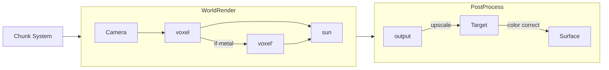

# Voxel Renderer

Written in Rust + [wgpu](https://github.com/gfx-rs/wgpu)

# Demo

- Raytraced shadows, procedural generation

- Metallic reflection

# Architecture

The raytracer uses a modified version of the algorithm presented in [A Fast Voxel Traversal Algorithm (1987) - Amanatides & Woo](http://www.cse.yorku.ca/~amana/research/grid.pdf)
